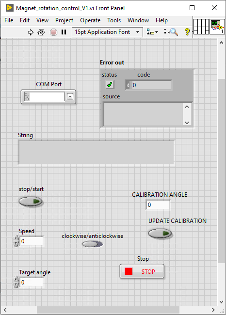

# Servo motor controller for electromagents

Magnets seen in bottom photo of [Cryostat-operating-software-LabView](https://github.com/danbrom123/Cryostat-operating-software-LabView) required precission angle and angle sweep capabilities.

Magnets are seated on a rotary table where the hand turn has been replaced with a servo-motor (powered by a driver), allowing for angle accuracy 0.1 deg and sweep rate of range 0.01-2 deg/s.

Labview VI written for ease of use also.

# Labview VI

Capabilities
- Stop/start rotation with clip of a button
- Calibration current angle of electromagets and change angle relative
- Rotate clockwise/anticlockwise
- Rotation speed
- Target angle (will stop automatically when reached this point)

